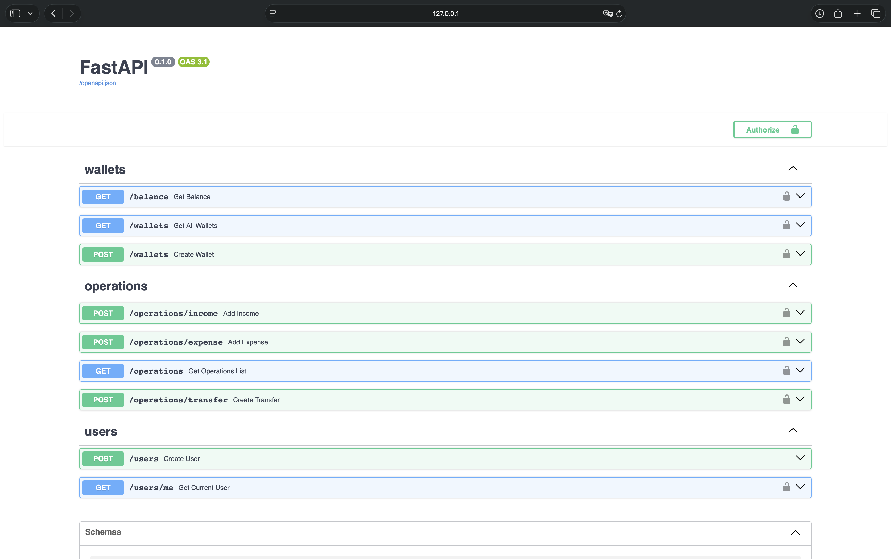

[](https://github.com/leomag/fastapi-demo/actions/workflows/main.yml)


## 📌 FastAPI Demo — демонстрационное backend-приложение

**FastAPI Demo** — это пример backend-сервиса, реализованного на базе фреймворка FastAPI. Проект демонстрирует базовую архитектуру REST API, работу с базой данных и применение асинхронного подхода в Python.



---

## 🚀 Основные возможности

- Реализация REST API с CRUD-операциями  
- Асинхронное взаимодействие с [Exchange API](https://github.com/fawazahmed0/exchange-api/)
- ML модель, определяющая на каком языке написано сообщение
- Работа с SQLite
- Валидация данных с использованием Pydantic  
- Автоматическая генерация документации (Swagger/Redoc)   

---

## 🏗️ Архитектура

Проект построен по классической слоистой архитектуре:

- **API слой** — обработка HTTP-запросов  
- **Сервисный слой** — бизнес-логика  
- **Слой данных** — модели и работа с БД  

Такой подход упрощает масштабирование и поддержку кода.

---

## 🧰 Используемый стек

- Python 3.x  
- FastAPI
- Uvicorn  
- SQLAlchemy
- Scikit-learn
- PostgreSQL  
- Pydantic  
- Isort
- Black
- Flake8
- Docker

---

## ⚙️ Развертывание

Проект можно запускать:

- локально (через uvicorn)  
- в Docker-контейнере  

---

## 🎯 Цель проекта

- Показать базовый шаблон FastAPI-приложения  
- Продемонстрировать лучшие практики организации backend-кода  
- Показать практики CI (линтинг, тесты, сборка приложения и упаковка в docker-образ c сохранением в GHCR)
- Показать практики CD (деплой сервиса в [Render](https://render.com))
- Служить отправной точкой для разработки production-ready сервисов  

---

## ⚙️ Запуск проекта

### 🔹 Локальный запуск через Docker

1. Клонируйте репозиторий:
```bash
git clone https://github.com/leomag/fastapi-demo.git
cd fastapi-demo
```

2. Соберите docker-образ, запустите его в контейнере:
```bash
docker build -t fastapi-demo .
docker run -d -p 8000:8000 fastapi-demo
```
3. Запустить сразу в контейнере (опционально):
```bash

```
Приложение будет доступно по адресу:
http://localhost:8000

Swagger-документация:
http://localhost:8000/docs

Redoс-документация:
http://localhost:8000/redoc